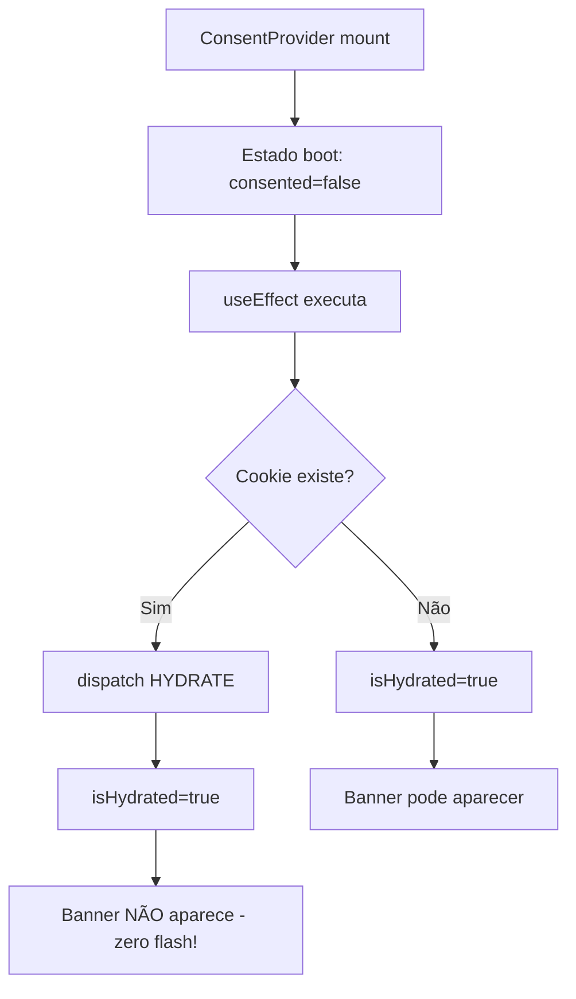
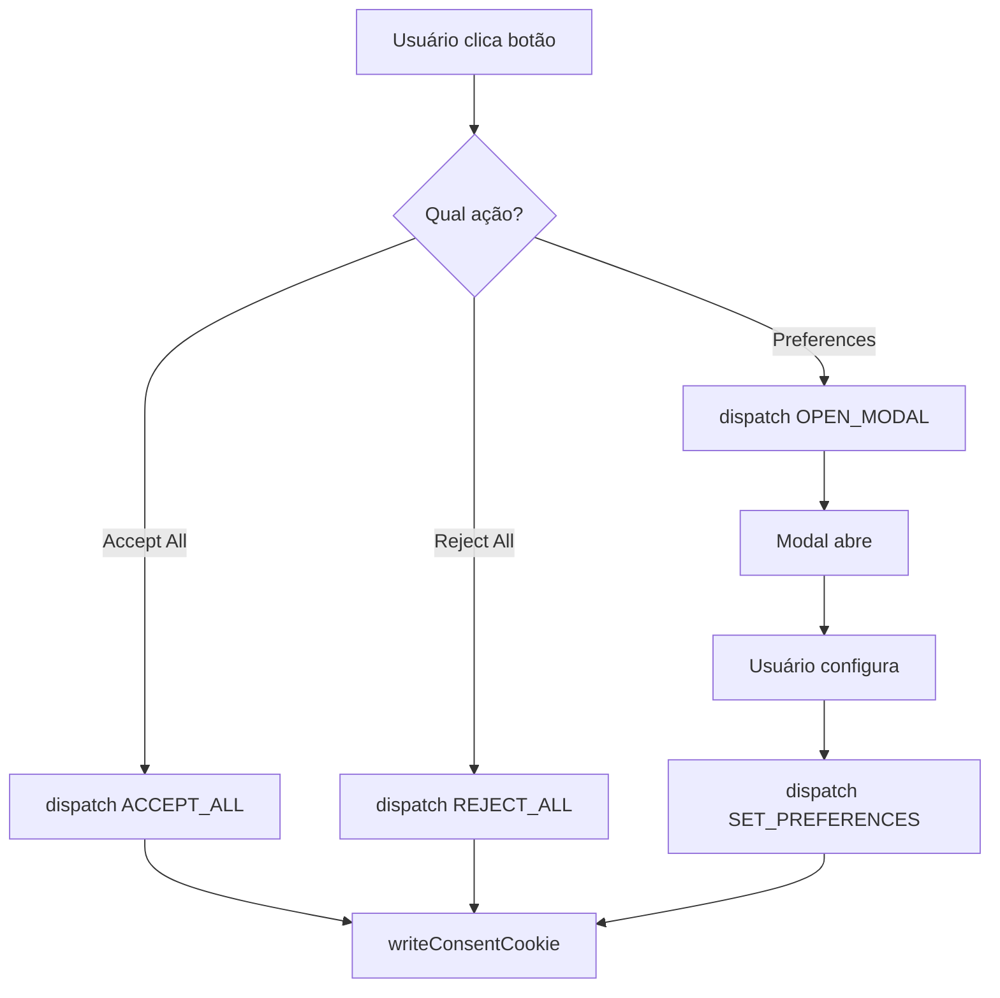

# Guia de Desenvolvimento - react-lgpd-consent

## 🏗️ Arquitetura da Biblioteca

### Visão Geral

A `react-lgpd-consent` é uma biblioteca **client-side** focada em aplicações React. A arquitetura é baseada em:

- **Context API**: Gerenciamento de estado global do consentimento.
- **Material-UI**: Componentes de interface prontos e customizáveis.
- **js-cookie**: Persistência leve e confiável das preferências do usuário.
- **TypeScript**: Type safety completo para uma melhor experiência de desenvolvimento.

### Status Atual (v0.3.1)

A versão atual é estável e focada em correções de produção e melhorias de compatibilidade. A arquitetura foi consolidada na v0.3.0 para renderizar a UI (banner, modal) automaticamente através do `ConsentProvider`, simplificando o uso. A v0.3.1 introduziu melhorias no controle programático do modal e na compatibilidade de temas.

### Suporte

- ✅ **Aplicações Client-Side**: React SPA, CRA, Vite, etc.
- ✅ **SSR (Server-Side Rendering)**: Compatível com Next.js, com hidratação através da prop `initialState` para evitar "flash" de conteúdo.

## 📁 Estrutura do Projeto

```
src/
├── components/         # Componentes UI (CookieBanner, PreferencesModal, etc.)
├── context/            # Contextos React (ConsentContext, CategoriesContext)
├── hooks/              # Hooks públicos (useConsent, useCategories, etc.)
├── types/              # Definições TypeScript
├── utils/              # Utilitários (ConsentGate, ScriptLoader, etc.)
└── index.ts            # Ponto de entrada da API pública
```

## 🔄 Fluxo de Estado

### 1. Inicialização



### 2. Interação do Usuário



## 🍪 Sistema de Cookies

O cookie armazena apenas as informações essenciais para a persistência do consentimento, em conformidade com o princípio de minimização de dados da LGPD.

### Formato do Cookie (v1.0)

```json
{
  "version": "1.0",
  "consented": true,
  "preferences": {
    "necessary": true,
    "analytics": false
  },
  "consentDate": "2025-08-12T14:30:00.000Z",
  "lastUpdate": "2025-08-12T14:30:00.000Z",
  "source": "banner",
  "projectConfig": {
    "enabledCategories": ["analytics"]
  }
}
```

## 🔧 Build e Bundle

O projeto utiliza `tsup` para compilar o código TypeScript para os formatos ESM e CJS, garantindo compatibilidade com diferentes sistemas de módulos.

### Configuração `tsup.config.js`

```javascript
export default {
  entry: ['src/index.ts'],
  format: ['esm', 'cjs'],
  dts: true,
  clean: true,
  external: ['react', 'react-dom', '@mui/material', 'js-cookie'],
  splitting: true,
  treeshake: true,
}
```

## 🧪 Estratégia de Testes

Os testes são escritos com Jest e React Testing Library e estão localizados junto aos arquivos de origem (`*.test.tsx`). Os cenários de teste críticos incluem:

1.  **Primeira visita**: O banner aparece corretamente.
2.  **Com cookie existente**: O banner não aparece (sem flash).
3.  **Persistência**: O estado é mantido após o refresh da página.
4.  **Ações dos botões**: As ações de aceitar/rejeitar/salvar funcionam e persistem o estado.
5.  **Modal**: O modal abre, permite a configuração e salva as preferências corretamente.

## 🤝 Contribuindo

### Setup Rápido

```bash
git clone https://github.com/lucianoedipo/react-lgpd-consent.git
cd react-lgpd-consent
npm install
npm run build
```

### Workflow de Desenvolvimento

1.  Crie uma branch: `git checkout -b feature/nova-funcionalidade`
2.  Desenvolva com `npm run dev` (ativa o modo watch do `tsup`).
3.  Adicione testes para sua nova funcionalidade.
4.  Verifique se todos os testes e o linter estão passando: `npm test` e `npm run lint`.
5.  Faça o commit seguindo o padrão de [Conventional Commits](https://www.conventionalcommits.org/).
6.  Abra um Pull Request no GitHub.

---

## 📞 Suporte para Desenvolvedores

-   **Bugs**: [GitHub Issues](https://github.com/lucianoedipo/react-lgpd-consent/issues)
-   **Dúvidas e Sugestões**: [GitHub Discussions](https://github.com/lucianoedipo/react-lgpd-consent/discussions)