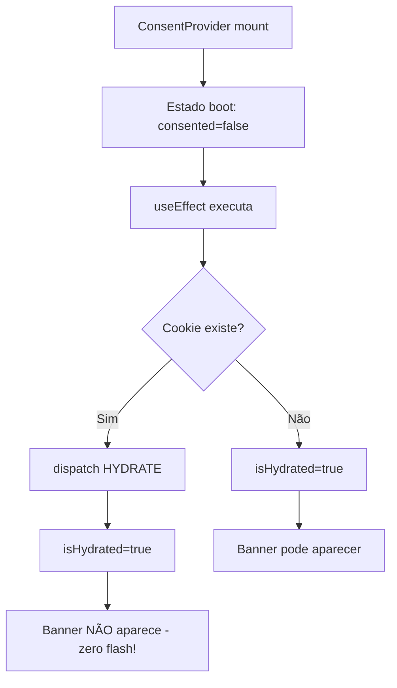
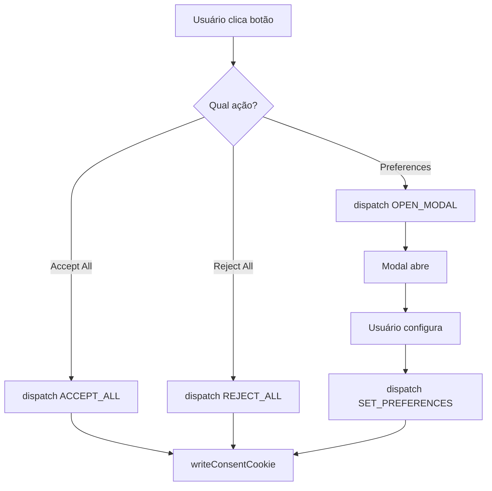
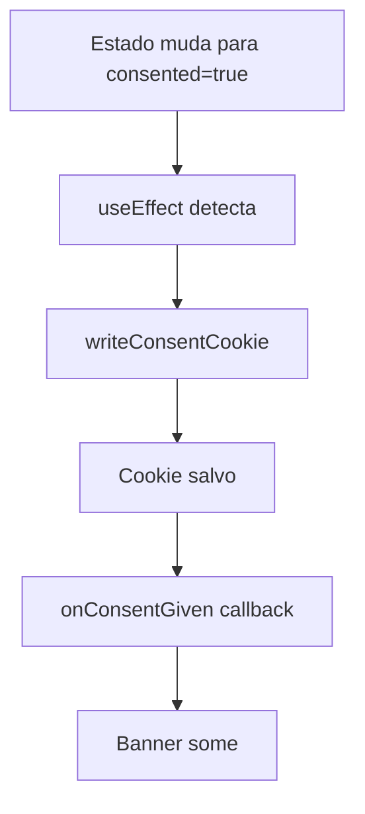

# Development Guide - react-lgpd-consent

## 🏗️ Arquitetura da Biblioteca

### Visão Geral

A `react-lgpd-consent` é uma biblioteca **client-side** focada em aplicações React SPA (Single Page Applications). A arquitetura é baseada em:

- **Context API**: Gerenciamento de estado global do consentimento
- **Material-UI**: Componentes de interface prontos e customizáveis
- **js-cookie**: Persistência leve e confiável
- **TypeScript**: Type safety completo

### Status Atual (v0.3.0)

🚨 **MUDANÇAS QUE QUEBRAM A COMPATIBILIDADE**

-   **Renderização Automática de Componentes UI Padrão**: O `ConsentProvider` agora gerencia a exibição do `CookieBanner` e do `FloatingPreferencesButton` por padrão.
-   **Componentes UI Sobrescrevíveis com Tipagem Clara**: Permite que desenvolvedores forneçam seus próprios componentes de banner, modal e botão flutuante com total segurança de tipo.
-   **Controle Simplificado do Modal**: A prop `disableAutomaticModal` foi removida. A visibilidade do modal é controlada exclusivamente pelo estado interno.
-   **Carregamento Imediato de Banner e Botão Flutuante**: Removido o lazy loading para `CookieBanner` e `FloatingPreferencesButton` para garantir visibilidade imediata e evitar falhas de carregamento.
-   **Remoção de Exports Diretos de Componentes UI**: `CookieBanner` e `FloatingPreferencesButton` não são mais exportados diretamente.
-   **Remoção do Hook `useConsentComponentProps`**: Este hook utilitário foi removido.

✅ **MELHORIAS E NOVAS FUNCIONALIDADES**

-   **Prop `disableDeveloperGuidance`**: Permite desabilitar os avisos e sugestões para desenvolvedores no console.
-   **Prop `reloadOnChange` para `ConsentScriptLoader`**: Permite recarregar scripts de integração quando as preferências de consentimento mudam.
-   **Ajuste de Posição da Marca**: A marca "fornecido por LÉdipO.eti.br" agora é exibida no canto inferior direito do banner e modal.

✅ **100% Backward Compatible** (com exceção das quebras de compatibilidade listadas acima)

### Suporte Completo

✅ **Client-Side Applications**: React SPA, CRA, Vite, etc.
✅ **Limited SSR Support**: Via prop `initialState` (sem flash)
✅ **Next.js Compatible**: Funciona com configuração adequada

## 📁 Estrutura do Projeto (v0.3.0)

```
src/
├── components/               # Componentes UI
│   ├── CookieBanner.tsx     # Banner principal
│   ├── PreferencesModal.tsx # Modal de configurações
│   ├── FloatingPreferencesButton.tsx # FAB
│   └── Branding.tsx         # Componente de branding
├── context/                 # Estado global
│   ├── ConsentContext.tsx   # Provider principal
│   ├── CategoriesContext.tsx # Provider de categorias customizadas (inclui useCategories e useCategoryStatus)
│   └── DesignContext.tsx    # Contexto para tokens de design
├── hooks/                   # Hooks públicos
│   └── useConsent.ts        # API principal
├── utils/                   # Utilitários
│   ├── ConsentGate.tsx      # Renderização condicional
│   ├── ConsentScriptLoader.tsx # Carregamento automático de scripts
│   ├── scriptIntegrations.ts # Integrações nativas (GA, GTM, UserWay)
│   ├── cookieUtils.ts       # Manipulação de cookies
│   ├── scriptLoader.ts      # Carregamento dinâmico
│   ├── theme.ts             # Tema padrão MUI
│   └── developerGuidance.ts # Sistema de orientações (lógica integrada ao ConsentContext)
├── types/                   # Definições TypeScript
│   └── types.ts             # Todos os tipos
└── index.ts                 # Exports públicos
```

## 🔄 Fluxo de Estado

### 1. Inicialização



### 2. Interação do Usuário



### 3. Persistência



## 🧩 Componentes Internos

### ConsentContext.tsx

**Responsabilidades:**

- Gerenciar estado global via useReducer
- Sincronizar com cookies inteligentes (apenas categorias ativas)
- Fornecer callbacks de eventos
- Lazy loading do modal (apenas o modal permanece lazy-loaded)
- Sistema de hidratação (zero flash)
- Integração com categorias customizadas
- Sistema de orientações automáticas
- Configuração padrão inteligente
- Validação de configuração do projeto

**Estados importantes:**

```typescript
interface ConsentState {
  consented: boolean // Se há consentimento
  preferences: ConsentPreferences // Apenas categorias ativas no projeto
  isModalOpen: boolean // Modal aberto/fechado
  version: string // Versioning do cookie
  consentDate?: string // Data do consentimento inicial
  lastUpdate?: string // Última atualização
  source?: 'banner' | 'modal' | 'api' // Origem do consentimento
  projectConfig?: ProjectCategoriesConfig // Snapshot da configuração de categorias
}

interface ConsentPreferences {
  necessary: boolean // Sempre true (essencial)
  [category: string]: boolean // Apenas categorias configuradas no projeto
}
```

**Actions do reducer:**

```typescript
type Action =
  | { type: 'ACCEPT_ALL'; config: ProjectCategoriesConfig } // Aceita todas as categorias
  | { type: 'REJECT_ALL'; config: ProjectCategoriesConfig } // Rejeita todas as categorias
  | { type: 'SET_CATEGORY'; category: Category; value: boolean } // Define preferência específica
  | { type: 'SET_PREFERENCES'; preferences: ConsentPreferences; config: ProjectCategoriesConfig } // Define múltiplas preferências
  | { type: 'OPEN_MODAL' } // Abre modal de configurações
  | { type: 'CLOSE_MODAL'; config: ProjectCategoriesConfig } // Fecha modal
  | { type: 'RESET'; config: ProjectCategoriesConfig } // Reseta para estado inicial
  | { type: 'HYDRATE'; state: ConsentState; config: ProjectCategoriesConfig } // Restaura do cookie
```

### CookieBanner.tsx

**Responsabilidades:**

- Renderizar banner quando necessário (controlado pelo `ConsentProvider`).
- Fornecer botões de ação.
- Suporte a modo bloqueante vs não-bloqueante.
- **Recebe props tipadas** (`CustomCookieBannerProps`) do `ConsentProvider`.

**Lógica de exibição (controlado pelo `ConsentProvider`):**

O `CookieBanner` é renderizado pelo `ConsentProvider` quando `!state.consented && isHydrated`.

### PreferencesModal.tsx

**Responsabilidades:**

- Interface de configuração granular.
- Switches para cada categoria.
- Lazy loading para otimizar bundle (permanece lazy-loaded).
- Acessibilidade completa.
- **Recebe props tipadas** (`CustomPreferencesModalProps`) do `ConsentProvider`.

### FloatingPreferencesButton.tsx

**Responsabilidades:**

- FAB posicionável (4 cantos da tela).
- Tooltip explicativo.
- Esconder/mostrar baseado em estado (controlado pelo `ConsentProvider`).
- Integração com tema MUI.
- **Recebe props tipadas** (`CustomFloatingPreferencesButtonProps`) do `ConsentProvider`.

## 🍪 Sistema de Cookies

### Configuração Padrão

```typescript
const DEFAULT_COOKIE_OPTS = {
  name: 'cookieConsent',
  maxAgeDays: 365,
  sameSite: 'Lax',
  secure: window.location.protocol === 'https:', // Auto-detecta
  path: '/',
}
```

### Estratégias de Persistência

1. **Imediata**: Cookie é salvo assim que há consentimento
2. **Segura**: Só salva se `state.consented === true`
3. **Resiliente**: Fallback para estado padrão se cookie corrompido

### Formato do Cookie (v0.3.0)

```json
{
  "version": "1.0",
  "consented": true,
  "preferences": {
    "necessary": true,
    "analytics": false
  },
  "consentDate": "2025-08-12T14:30:00.000Z",
  "lastUpdate": "2025-08-12T14:30:00.000Z",
  "source": "banner",
  "projectConfig": {
    "enabledCategories": ["analytics"]
  }
}
```

## 🎯 Sistema de Hidratação (Zero Flash)

### Problema Original

```typescript
// ❌ ANTES: Banner aparecia e sumia rapidamente
function CookieBanner() {
  const { consented } = useConsent()

  // Problema: consented inicia como false, depois vira true
  if (!consented) return <Banner />
  return null
}
```

### Solução Implementada (v0.3.0)

A lógica de hidratação e a decisão de renderizar o banner agora são gerenciadas centralmente no `ConsentProvider`, garantindo que o banner só apareça após a verificação do cookie e se o consentimento ainda não foi dado.

```typescript
// ✅ AGORA: Banner só aparece se realmente necessário (lógica no ConsentProvider)
// O CookieBanner não precisa mais da lógica de hidratação interna.
function CookieBanner() {
  // ... (implementação interna do banner)
  // Ele recebe as props 'consented' e 'texts' do ConsentProvider
}
```

### Fluxo de Hidratação (v0.3.0)

1. **Mount**: `isHydrated = false`, banner não aparece.
2. **useEffect no ConsentProvider**: Lê cookie, se existir atualiza estado.
3. **Conclusão**: `isHydrated = true`.
4. **Render**: `ConsentProvider` re-renderiza e o `CookieBanner` aparece apenas se `!state.consented && isHydrated` for verdadeiro.

### Fluxo de Hidratação

1. **Mount**: `isHydrated = false`, banner não aparece
2. **useEffect**: Lee cookie, se existir atualiza estado
3. **Conclusão**: `isHydrated = true`
4. **Render**: Banner aparece apenas se realmente não há consentimento

## 🔧 Build e Bundle

### Configuração tsup

```javascript
// tsup.config.js
export default {
  entry: ['src/index.ts'],
  format: ['esm', 'cjs'],
  dts: true,
  clean: true,
  external: ['react', 'react-dom', '@mui/material', 'js-cookie'],
  splitting: true,
  treeshake: true,
}
```

### Bundle Atual (v0.3.0)

- **ESM**: (TBD) KB
- **CJS**: (TBD) KB
- **Types**: (TBD) KB
- **Gzipped**: (TBD) KB total

### Otimizações Implementadas

1. **Lazy Loading**: Modal de Preferências só carrega quando necessário (Banner e Botão Flutuante não são lazy-loaded para garantir visibilidade imediata).
2. **Tree Shaking**: Imports individuais do MUI
3. **Code Splitting**: Chunk separado para PreferencesModal
4. **External Dependencies**: React, MUI e js-cookie como peers

## 🧪 Testing Strategy

### Cenários Críticos

1. **Primeira visita**: Banner aparece, funcionalidade funciona
2. **Com cookie**: Banner não aparece (zero flash)
3. **Refresh após consentimento**: Estado persistido
4. **Botões funcionais**: Accept/Reject funcionam após refresh
5. **Modal**: Abre, configura, salva corretamente
6. **FAB**: Aparece/some conforme configuração

### Test Setup (Futuro)

```bash
# Dependências de teste recomendadas
npm install -D @testing-library/react @testing-library/jest-dom
npm install -D @testing-library/user-event jsdom
```

### Exemplo de Teste

```typescript
// __tests__/CookieBanner.test.tsx
import { render, screen } from '@testing-library/react'
import { ConsentProvider, CookieBanner } from '../src'

test('banner não aparece com cookie existente', () => {
  // Mock cookie existente
  document.cookie = 'cookieConsent={"consented":true,"preferences":{"analytics":true}}'

  render(
    <ConsentProvider>
      <CookieBanner />
    </ConsentProvider>
  )

  // Banner não deve aparecer
  expect(screen.queryByText(/cookies/i)).not.toBeInTheDocument()
})
```

## 🚀 Performance Considerations

### Lazy Loading

```typescript
// Modal só carrega quando necessário
const PreferencesModal = React.lazy(() =>
  import('../components/PreferencesModal').then((m) => ({
    default: m.PreferencesModal,
  })),
)
```

### Memoization

```typescript
// Evita re-renders desnecessários
const api = React.useMemo<ConsentContextValue>(() => {
  return {
    consented: !!state.consented,
    preferences: state.preferences,
    // ... actions
  }
}, [state, cookie])
```

### Bundle Size Monitoring

```bash
# Verificar tamanho após mudanças
npm run build
ls -la dist/
```

## 🔮 Roadmap Técnico

### v0.3.0 (Atual) - Refatoração e Quebra de Compatibilidade

-   **Foco**: Consolidação da arquitetura, melhoria da experiência do desenvolvedor (DX) e preparação para futuras expansões.

### Próximas Versões (Pseudo-Versioning)

-   **v+1.0.0 (Multi-Regulamentação e Conformidade Avançada)**:
    -   **Geolocalização-based Consent**: Detecção automática da região do usuário para aplicar a regulamentação relevante (LGPD, GDPR, CCPA).
    -   **Configurable Regulation Profiles**: Definição de perfis de regulamentação com requisitos específicos.
    -   **Dynamic Text Adaptation**: Textos adaptáveis com base na regulamentação ativa.
    -   **Modal Detalhado de Cookies**: Exibição de informações técnicas sobre cada cookie (nome, duração, provedor).
    -   **Logs de Auditoria**: Sistema de log client-side para registrar todas as interações de consentimento do usuário.
    -   **Templates Setoriais**: Configurações e textos pré-definidos para setores específicos (governo, saúde, e-commerce).
    -   **Plugin System**: Sistema de plugins para extensibilidade de integrações e lógica customizada.
    -   **Improved `ConsentGate`**: Controle mais granular (e.g., `analytics AND functional`).
    -   **Enhanced Developer Guidance**: Mais avisos e sugestões detalhadas.

## 🐛 Debugging

### Dev Tools

```typescript
// Acessar estado no console do browser
window.__REACT_DEVTOOLS_GLOBAL_HOOK__
```

## 📋 Checklist para Contribuições

### Antes de submeter PR:

- [ ] `npm run build` sem erros
- [ ] `npm run type-check` sem erros
- [ ] `npm run lint` sem warnings
- [ ] Bundle size não aumentou significativamente
- [ ] Testes manuais em Chrome/Firefox/Safari
- [ ] Documentação atualizada se necessário
- [ ] CHANGELOG.md atualizado

### Convenções:

1. **Commits**: Use conventional commits (`feat:`, `fix:`, `docs:`)
2. **Types**: Sempre `Readonly<T>` para props
3. **Imports**: Individuais do MUI (`import Button from '@mui/material/Button'`)
4. **API**: Pública em inglês, UI em português por padrão
5. **Backward compatibility**: Nunca quebrar em minor versions

## 🤝 Contribuindo

### Setup Rápido

```bash
git clone https://github.com/lucianoedipo/react-lgpd-consent.git
cd react-lgpd-consent
npm install
npm run build
```

### Workflow de Desenvolvimento

1. Criar branch: `git checkout -b feature/nova-funcionalidade`
2. Desenvolver com `npm run dev` (watch mode)
3. Testar com exemplo em `test-app/`
4. Build: `npm run build`
5. Commit: `git commit -m "feat: adiciona nova funcionalidade"`
6. Push: `git push origin feature/nova-funcionalidade`
7. Abrir PR no GitHub

---

## 📞 Suporte para Desenvolvedores

- 🐛 **Bugs**: [GitHub Issues](https://github.com/lucianoedipo/react-lgpd-consent/issues)
- 💡 **Feature Requests**: GitHub Discussions
- 📧 **Email**: luciano.psilva@anpd.gov.br
- 📚 **Docs**: README.md + este arquivo

**Happy coding! 🚀**
