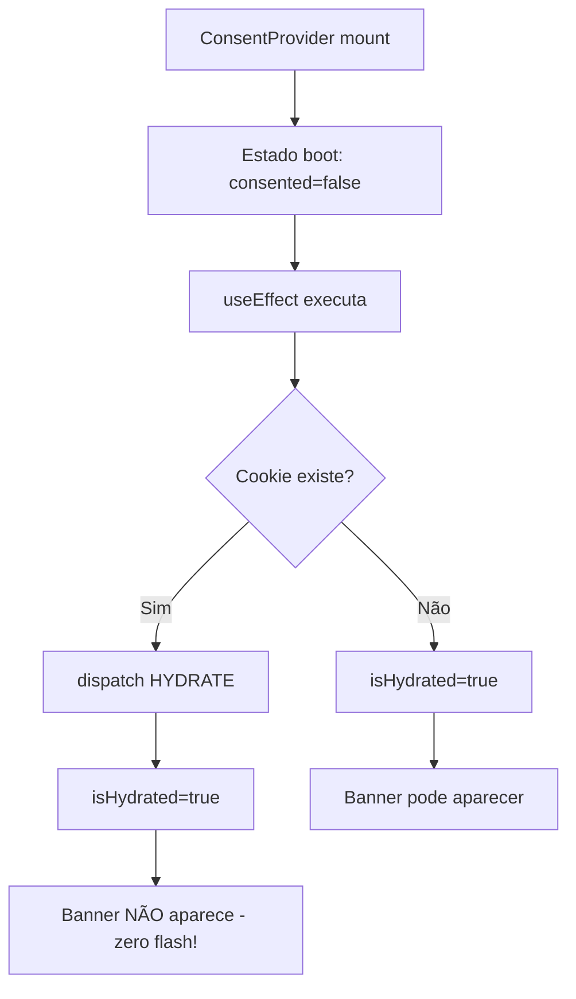
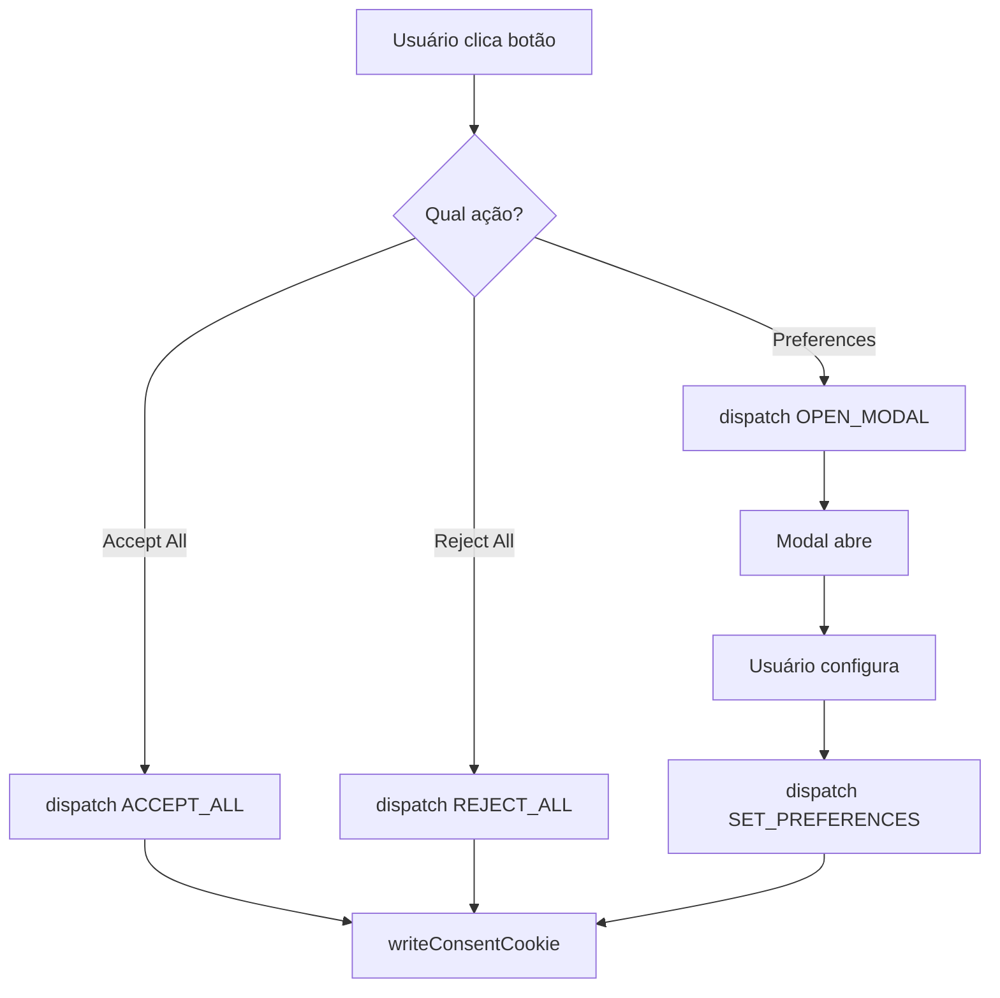

# Guia de Desenvolvimento - react-lgpd-consent

## ⚙️ Requisitos de Desenvolvimento

### Node.js
- **Versão mínima**: Node.js 20.0.0 ou superior
- **Recomendado**: Use a versão especificada no arquivo `.nvmrc`

Para verificar sua versão:
```bash
node --version
```

Para usar a versão correta com nvm:
```bash
nvm use
# ou
nvm use 20
```

### Outras Dependências
- npm (vem com Node.js)
- TypeScript (instalado como dev dependency)

## 🏗️ Arquitetura da Biblioteca

### Visão Geral

Desde a versão **0.5.0** a biblioteca é publicada como um **workspace PNPM** composto por três pacotes:

- `@react-lgpd-consent/core`: Núcleo com contextos, hooks, validadores, integrações e utilitários (sem compromisso com UI).
- `@react-lgpd-consent/mui`: Camada de componentes baseada em Material-UI. Inicialmente funciona como _proxy_ dos componentes existentes.
- `react-lgpd-consent`: Pacote agregador que mantém a API pública atual e reexporta os módulos dos pacotes anteriores.

A stack continua baseada em:

- **Context API** para gerenciamento global do consentimento.
- **js-cookie** + **zod** para persistência e validação.
- **TypeScript** para garantir contratos estáveis.
- **Material-UI** opcional para os componentes fornecidos pela camada MUI.

### Status Atual (v0.5.0)

- Estrutura modularizada em workspace sem quebrar a API existente.
- `@react-lgpd-consent/mui` inicia como package de fachada para os componentes padrão.
- Documentação e pipeline atualizados para trabalhar com filtros `pnpm --filter`.

### Suporte

- ✅ **Aplicações Client-Side**: React SPA, CRA, Vite, etc.
- ✅ **SSR (Server-Side Rendering)**: Compatível com Next.js, com hidratação através da prop `initialState` para evitar "flash" de conteúdo.
- ✅ **React 19 StrictMode**: Totalmente compatível com double-invoking de efeitos em desenvolvimento (ver [REACT19-STRICTMODE.md](./docs/REACT19-STRICTMODE.md))

### Princípios de Design para Efeitos

**Todos os efeitos nesta biblioteca seguem estes princípios:**

1. **Idempotência**: Executar um efeito múltiplas vezes produz o mesmo resultado
2. **Cleanup Adequado**: Todo efeito com side-effects tem função de cleanup
3. **SSR-Safe**: Verificação de `typeof window/document !== 'undefined'`
4. **StrictMode-Safe**: Proteção contra double-invoking em desenvolvimento

Consulte [REACT19-STRICTMODE.md](./docs/REACT19-STRICTMODE.md) para detalhes da implementação.

## 🍪 Estratégia de cookie por ambiente

- **Localhost / desenvolvimento**
  ```tsx
  cookie: {
    name: 'consent-dev',
    domain: undefined, // não compartilha entre subdomínios
    sameSite: 'Lax',
    secure: false, // localhost sem HTTPS
  }
  ```

- **Staging (ex.: dev.example.com, api.dev.example.com)**
  ```tsx
  cookie: {
    name: 'consent-staging',
    domain: '.example.com', // compartilha entre subdomínios
    sameSite: 'Lax',
    secure: true, // exige HTTPS
  }
  ```

- **Produção (example.com + www.example.com)**
  ```tsx
  cookie: {
    name: 'consent',
    domain: '.example.com',
    sameSite: 'Lax',
    secure: true,
  }
  ```

Notas rápidas:
- Não há dependência de `NODE_ENV` para o cookie; configure explicitamente via prop `cookie`.
- Para compartilhar entre subdomínios, sempre use `domain` com ponto (`.example.com`) e `secure: true`.

## 📁 Estrutura do Projeto

packages/
├── core/               # Núcleo (contextos, hooks, utils, tipos)
│   └── src/
├── mui/                # Camada Material-UI (reexporta componentes)
│   └── src/
└── react-lgpd-consent/ # Pacote agregador publicado no npm
    └── src/
```

## 🔄 Fluxo de Estado

### 1. Inicialização



### 2. Interação do Usuário



## 🍪 Sistema de Cookies

O cookie armazena apenas as informações essenciais para a persistência do consentimento, em conformidade com o princípio de minimização de dados da LGPD.

### Formato do Cookie (v1.0)

```json
{
  "version": "1.0",
  "consented": true,
  "preferences": {
    "necessary": true,
    "analytics": false
  },
  "consentDate": "2025-08-12T14:30:00.000Z",
  "lastUpdate": "2025-08-12T14:30:00.000Z",
  "source": "banner",
  "projectConfig": {
    "enabledCategories": ["analytics"]
  }
}
```

## 🔧 Build e Bundle

O projeto utiliza `tsup` para compilar o código TypeScript para os formatos ESM e CJS, garantindo compatibilidade com diferentes sistemas de módulos.

### Configuração `packages/react-lgpd-consent/tsup.config.ts`

```ts
export default defineConfig({
  entry: ['src/index.ts', 'src/core.ts', 'src/mui.ts'],
  format: ['esm', 'cjs'],
  dts: true,
  clean: true,
  splitting: true,
  treeshake: true,
  external: [
    'react',
    'react-dom',
    'react/jsx-runtime',
    '@react-lgpd-consent/core',
    '@react-lgpd-consent/mui',
  ],
})
```

## 🧪 Estratégia de Testes

Os testes são escritos com Jest e React Testing Library e estão localizados junto aos arquivos de origem (`*.test.tsx`). Os cenários de teste críticos incluem:

1.  **Primeira visita**: O banner aparece corretamente.
2.  **Com cookie existente**: O banner não aparece (sem flash).
3.  **Persistência**: O estado é mantido após o refresh da página.
4.  **Ações dos botões**: As ações de aceitar/rejeitar/salvar funcionam e persistem o estado.
5.  **Modal**: O modal abre, permite a configuração e salva as preferências corretamente.

### Cobertura de Testes

O projeto mantém uma cobertura de testes abrangente:

| Módulo | Statements | Branches | Functions | Lines |
|--------|------------|----------|-----------|-------|
| **Total** | 95%+ | 84%+ | 80%+ | 97%+ |
| core/context | 97% | 92% | 96% | 98% |
| core/hooks | 100% | 100% | 100% | 100% |
| core/utils | 94% | 83% | 98% | 97% |
| mui/components | 92% | 77% | 88% | 94% |
| mui/utils | 100% | 100% | 100% | 100% |

Para rodar os testes com cobertura:

```bash
pnpm test:coverage
```

## 🤝 Contribuindo

### Setup Rápido

```bash
git clone https://github.com/lucianoedipo/react-lgpd-consent.git
cd react-lgpd-consent
pnpm install
pnpm --filter react-lgpd-consent build
```

### Workflow de Desenvolvimento

1.  Crie uma branch: `git checkout -b feature/nova-funcionalidade`
2.  Desenvolva com `pnpm --filter react-lgpd-consent dev` (modo watch do `tsup`).
3.  Adicione testes para sua nova funcionalidade.
4.  Verifique se todos os testes e o linter estão passando: `pnpm test` e `pnpm lint`.
5.  Faça o commit seguindo o padrão de [Conventional Commits](https://www.conventionalcommits.org/).
6.  Abra um Pull Request no GitHub.

---

## 📞 Suporte para Desenvolvedores

-   **Bugs**: [GitHub Issues](https://github.com/lucianoedipo/react-lgpd-consent/issues)
-   **Dúvidas e Sugestões**: [GitHub Discussions](https://github.com/lucianoedipo/react-lgpd-consent/discussions)

## 🐛 Nota de Troubleshooting: FloatingPreferencesButton não recebia props do Provider

Situação encontrada (2025-08-25):


Causa:


Correção aplicada:


Como testar localmente:

1. Rode `npm run storybook`.
2. Abra a story `Components / FloatingPreferencesButton`.
3. No painel Controls, altere `tooltip` e verifique o hover do botão.
4. Ative `hideWhenConsented` e simule consentimento (ou remova o cookie e aceite) para verificar que o botão desaparece quando `consented === true`.

Notas:


## Storybook — notas para desenvolvedores

- Arquivos importantes:
  - `.storybook/main.ts` — configuração do Storybook (addons, framework)
  - `.storybook/preview.tsx` — decorator global que aplica `ThemeProvider`, `CssBaseline` e faz limpeza defensiva entre stories (remove cookie de consentimento, limpa nós portaled e força remount por story id)
  - `src/components/*.stories.tsx` — stories de componentes; prefira passar `floatingPreferencesButtonProps` para o `ConsentProvider` quando o provider monta o componente automaticamente

- Dicas:
  - Ao criar stories que testem comportamentos ligados ao cookie, use o preview para garantir estado inicial limpo (o preview já remove o cookie por padrão).
  - Evite montar manualmente múltiplas instâncias do `ConsentProvider` nas mesmas stories; prefira usar a instância gerenciada pelo preview para evitar UI duplicada.
  - Se um story precisar de um tema escuro, passe `theme={createTheme({ palette: { mode: 'dark' } })}` para o `ConsentProvider` na story.
