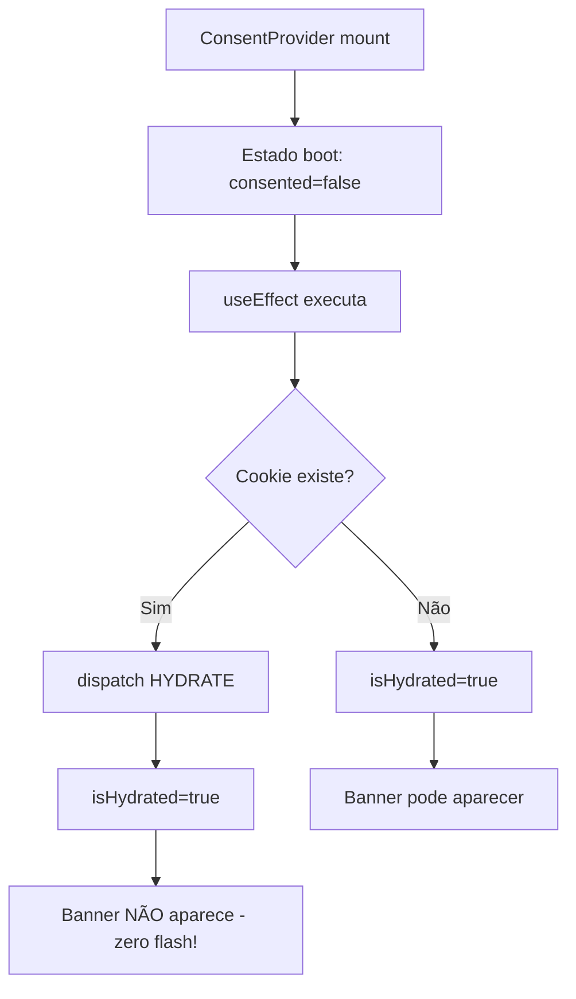
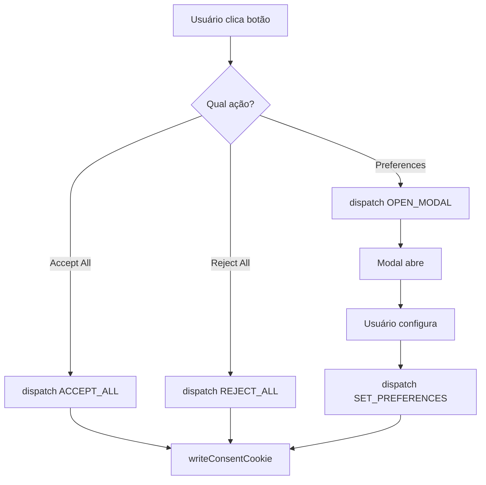
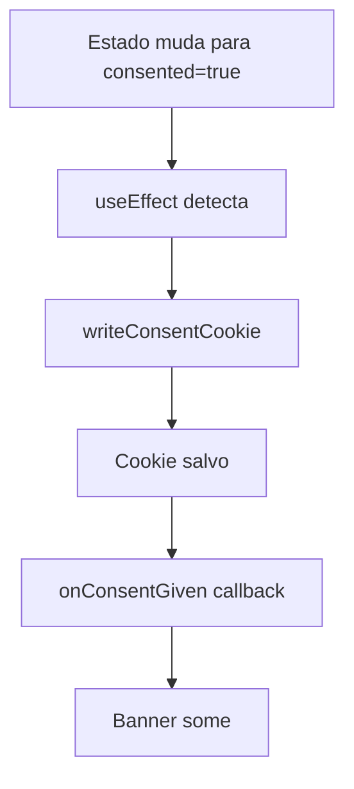

# Development Guide - react-lgpd-consent

## 🏗️ Arquitetura da Biblioteca

### Visão Geral

A `react-lgpd-consent` é uma biblioteca **client-side** focada em aplicações React SPA (Single Page Applications). A arquitetura é baseada em:

- **Context API**: Gerenciamento de estado global do consentimento
- **Material-UI**: Componentes de interface prontos e customizáveis
- **js-cookie**: Persistência leve e confiável
- **TypeScript**: Type safety completo

### Status Atual (v0.2.2)

✅ **IMPLEMENTADO**: Sistema de Orientações para Desenvolvedores

- ✅ **UI Dinâmica**: Componentes se adaptam automaticamente à configuração
- ✅ **Orientação Automática**: Console com avisos e sugestões de compliance
- ✅ **Hooks Avançados**: `useCategories()` e `useCategoryStatus()` para controle total
- ✅ **Configuração Inteligente**: Padrão defensivo previne problemas comuns
- ✅ **100% Backward Compatible**: APIs v0.1.x e v0.2.x funcionam perfeitamente

### Suporte Completo

✅ **Client-Side Applications**: React SPA, CRA, Vite, etc.
✅ **Limited SSR Support**: Via prop `initialState` (sem flash)
✅ **Next.js Compatible**: Funciona com configuração adequada

## 📁 Estrutura do Projeto (v0.2.2)

```
src/
├── components/               # Componentes UI
│   ├── CookieBanner.tsx     # Banner principal
│   ├── PreferencesModal.tsx # Modal de configurações
│   ├── FloatingPreferencesButton.tsx # FAB
│   └── Branding.tsx         # Componente de branding
├── context/                 # Estado global
│   ├── ConsentContext.tsx   # Provider principal (v0.2.2 - Sistema de Orientações)
│   └── CategoriesContext.tsx # Provider de categorias customizadas
├── hooks/                   # Hooks públicos
│   ├── useConsent.ts        # API principal
│   ├── useCategories.ts     # 🆕 v0.2.2 - Hook de categorias ativas
│   └── useCategoryStatus.ts # 🆕 v0.2.2 - Status de categoria específica
├── utils/                   # Utilitários
│   ├── ConsentGate.tsx      # Renderização condicional
│   ├── ConsentScriptLoader.tsx # Carregamento automático de scripts
│   ├── scriptIntegrations.ts # Integrações nativas (GA, GTM, UserWay)
│   ├── cookieUtils.ts       # Manipulação de cookies
│   ├── scriptLoader.ts      # Carregamento dinâmico
│   ├── theme.ts             # Tema padrão MUI
│   └── developerGuidance.ts # 🆕 v0.2.2 - Sistema de orientações
├── types/                   # Definições TypeScript
│   └── types.ts             # Todos os tipos (expandido v0.2.2)
└── index.ts                 # Exports públicos (expandido v0.2.2)
```

### 🆕 Novos Arquivos v0.2.2

- **`useCategories.ts`**: Hook para informações sobre categorias ativas no projeto
- **`useCategoryStatus.ts`**: Hook para verificar se categoria específica está configurada
- **`developerGuidance.ts`**: Sistema inteligente de orientações e validação

## 🔄 Fluxo de Estado

### 1. Inicialização



### 2. Interação do Usuário



### 3. Persistência



## 🧩 Componentes Internos

### ConsentContext.tsx ✨ **EXPANDIDO v0.2.2**

**Responsabilidades (v0.2.2):**

- Gerenciar estado global via useReducer
- Sincronizar com cookies inteligentes (apenas categorias ativas)
- Fornecer callbacks de eventos
- Lazy loading do modal
- Sistema de hidratação (zero flash)
- Integração com categorias customizadas
- **🆕 Sistema de orientações automáticas**
- **🆕 Configuração padrão inteligente**
- **🆕 Validação de configuração do projeto**

**Estados importantes (v0.2.2):**

```typescript
interface ConsentState {
  consented: boolean // Se há consentimento
  preferences: ConsentPreferences // Apenas categorias ativas no projeto
  isModalOpen: boolean // Modal aberto/fechado
  version: string // 🆕 Versioning do cookie
  consentDate?: string // 🆕 Data do consentimento inicial
  lastUpdate?: string // 🆕 Última atualização
  source?: 'banner' | 'modal' | 'api' // 🆕 Origem do consentimento
}

interface ConsentPreferences {
  necessary: boolean // Sempre true (essencial)
  [category: string]: boolean // Apenas categorias configuradas no projeto
}
```

**Actions do reducer:**

```typescript
type Action =
  | { type: 'ACCEPT_ALL' } // Aceita todas as categorias
  | { type: 'REJECT_ALL' } // Rejeita todas as categorias
  | { type: 'SET_PREFERENCES'; preferences: ConsentPreferences }
  | { type: 'OPEN_MODAL' } // Abre modal de configurações
  | { type: 'CLOSE_MODAL' } // Fecha modal
  | { type: 'RESET' } // Reseta para estado inicial
  | { type: 'HYDRATE'; state: ConsentState } // Restaura do cookie
```

### CookieBanner.tsx

**Responsabilidades:**

- Renderizar banner quando necessário
- Fornecer botões de ação
- Suporte a modo bloqueante vs não-bloqueante
- Integração com sistema de hidratação

**Lógica de exibição:**

```typescript
// ❌ PROBLEMA: Flash do banner
const open = debug ? true : !consented

// ✅ SOLUÇÃO: Zero flash
const open = debug ? true : isHydrated && !consented
```

### PreferencesModal.tsx

**Responsabilidades:**

- Interface de configuração granular
- Switches para cada categoria
- Lazy loading para otimizar bundle
- Acessibilidade completa

### FloatingPreferencesButton.tsx

**Responsabilidades:**

- FAB posicionável (4 cantos da tela)
- Tooltip explicativo
- Esconder/mostrar baseado em estado
- Integração com tema MUI

## 🍪 Sistema de Cookies

### Configuração Padrão

```typescript
const DEFAULT_COOKIE_OPTS = {
  name: 'cookieConsent',
  maxAgeDays: 365,
  sameSite: 'Lax',
  secure: window.location.protocol === 'https:', // Auto-detecta
  path: '/',
}
```

### Estratégias de Persistência

1. **Imediata**: Cookie é salvo assim que há consentimento
2. **Segura**: Só salva se `state.consented === true`
3. **Resiliente**: Fallback para estado padrão se cookie corrompido

### Formato do Cookie

```json
{
  "consented": true,
  "preferences": {
    "analytics": true,
    "marketing": false
  },
  "isModalOpen": false
}
```

## 🎯 Sistema de Hidratação (Zero Flash)

### Problema Original

```typescript
// ❌ ANTES: Banner aparecia e sumia rapidamente
function CookieBanner() {
  const { consented } = useConsent()

  // Problema: consented inicia como false, depois vira true
  if (!consented) return <Banner />
  return null
}
```

### Solução Implementada

```typescript
// ✅ AGORA: Banner só aparece se realmente necessário
function CookieBanner() {
  const { consented } = useConsent()
  const isHydrated = useConsentHydration() // 🎯 KEY!

  // Só mostra após verificar cookie existente
  if (!isHydrated || consented) return null
  return <Banner />
}
```

### Fluxo de Hidratação

1. **Mount**: `isHydrated = false`, banner não aparece
2. **useEffect**: Lee cookie, se existir atualiza estado
3. **Conclusão**: `isHydrated = true`
4. **Render**: Banner aparece apenas se realmente não há consentimento

## 🔧 Build e Bundle

### Configuração tsup

```javascript
// tsup.config.js
export default {
  entry: ['src/index.ts'],
  format: ['esm', 'cjs'],
  dts: true,
  clean: true,
  external: ['react', 'react-dom', '@mui/material', 'js-cookie'],
  splitting: true,
  treeshake: true,
}
```

### Bundle Atual (v0.1.11)

- **ESM**: 6.65 KB + 14.08 KB chunk
- **CJS**: 26.43 KB
- **Types**: 6.73 KB
- **Gzipped**: ~8 KB total

### Otimizações Implementadas

1. **Lazy Loading**: Modal só carrega quando necessário
2. **Tree Shaking**: Imports individuais do MUI
3. **Code Splitting**: Chunk separado para PreferencesModal
4. **External Dependencies**: React, MUI e js-cookie como peers

## 🧪 Testing Strategy

### Cenários Críticos

1. **Primeira visita**: Banner aparece, funcionalidade funciona
2. **Com cookie**: Banner não aparece (zero flash)
3. **Refresh após consentimento**: Estado persistido
4. **Botões funcionais**: Accept/Reject funcionam após refresh
5. **Modal**: Abre, configura, salva corretamente
6. **FAB**: Aparece/some conforme configuração

### Test Setup (Futuro)

```bash
# Dependências de teste recomendadas
npm install -D @testing-library/react @testing-library/jest-dom
npm install -D @testing-library/user-event jsdom
```

### Exemplo de Teste

```typescript
// __tests__/CookieBanner.test.tsx
import { render, screen } from '@testing-library/react'
import { ConsentProvider, CookieBanner } from '../src'

test('banner não aparece com cookie existente', () => {
  // Mock cookie existente
  document.cookie = 'cookieConsent={"consented":true,"preferences":{"analytics":true}}'

  render(
    <ConsentProvider>
      <CookieBanner />
    </ConsentProvider>
  )

  // Banner não deve aparecer
  expect(screen.queryByText(/cookies/i)).not.toBeInTheDocument()
})
```

## 🚀 Performance Considerations

### Lazy Loading

```typescript
// Modal só carrega quando necessário
const PreferencesModal = React.lazy(() =>
  import('../components/PreferencesModal').then((m) => ({
    default: m.PreferencesModal,
  })),
)
```

### Memoization

```typescript
// Evita re-renders desnecessários
const api = React.useMemo<ConsentContextValue>(() => {
  return {
    consented: !!state.consented,
    preferences: state.preferences,
    // ... actions
  }
}, [state, cookie])
```

### Bundle Size Monitoring

```bash
# Verificar tamanho após mudanças
npm run build
ls -la dist/
```

## 🔮 Roadmap Técnico

### v0.2.0 - Robustez

- [ ] Validação de schema do cookie
- [ ] Fallback para localStorage se cookies desabilitados
- [ ] Retry logic para writeConsentCookie
- [ ] Logging estruturado opcional

### v0.3.0 - DX Melhorado

- [ ] Storybook para componentes
- [ ] Playground online
- [ ] Templates de configuração
- [ ] CLI para setup inicial

### v0.4.0 - SSR Support (Major)

- [ ] Compatibilidade Next.js
- [ ] Hidratação sem flash em SSR
- [ ] Edge runtime support
- [ ] Streaming SSR compatibility

### v0.5.0 - Enterprise

- [ ] Audit logs
- [ ] Compliance dashboard
- [ ] Multi-tenant support
- [ ] Analytics integration

## 🐛 Debugging

### Console Logs

A biblioteca usa console.log para debugging em desenvolvimento:

```typescript
console.log('🚀 Immediate hydration: Cookie found', saved)
console.log('💾 Saving state to cookie:', state)
```

### Debug Props

```tsx
<CookieBanner debug={true} /> // Força exibição
<FloatingPreferencesButton debug={true} /> // Logs extras
```

### Dev Tools

```typescript
// Acessar estado no console do browser
window.__REACT_DEVTOOLS_GLOBAL_HOOK__
```

## 📋 Checklist para Contribuições

### Antes de submeter PR:

- [ ] `npm run build` sem erros
- [ ] `npm run type-check` sem erros
- [ ] `npm run lint` sem warnings
- [ ] Bundle size não aumentou significativamente
- [ ] Testes manuais em Chrome/Firefox/Safari
- [ ] Documentação atualizada se necessário
- [ ] CHANGELOG.md atualizado

### Convenções:

1. **Commits**: Use conventional commits (`feat:`, `fix:`, `docs:`)
2. **Types**: Sempre `Readonly<T>` para props
3. **Imports**: Individuais do MUI (`import Button from '@mui/material/Button'`)
4. **API**: Pública em inglês, UI em português por padrão
5. **Backward compatibility**: Nunca quebrar em minor versions

## 🤝 Contribuindo

### Setup Rápido

```bash
git clone https://github.com/lucianoedipo/react-lgpd-consent.git
cd react-lgpd-consent
npm install
npm run build
```

### Workflow de Desenvolvimento

1. Criar branch: `git checkout -b feature/nova-funcionalidade`
2. Desenvolver com `npm run dev` (watch mode)
3. Testar com exemplo em `test-app/`
4. Build: `npm run build`
5. Commit: `git commit -m "feat: adiciona nova funcionalidade"`
6. Push: `git push origin feature/nova-funcionalidade`
7. Abrir PR no GitHub

---

## 📞 Suporte para Desenvolvedores

- 🐛 **Bugs**: [GitHub Issues](https://github.com/lucianoedipo/react-lgpd-consent/issues)
- 💡 **Feature Requests**: GitHub Discussions
- 📧 **Email**: luciano.psilva@anpd.gov.br
- 📚 **Docs**: README.md + este arquivo

**Happy coding! 🚀**
